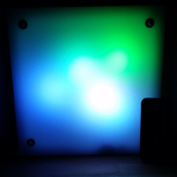
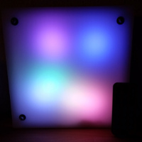
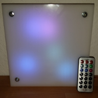
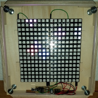
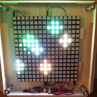

<h1>LED Lamp</h1>
<table>
<tr><th>Date</th><td>2016-12</td></tr>
<tr><th>Tool Version</th><td>Arduino IDE 1.6.12 (Windows) (avrdude 6.3, avr-gcc 4.9.2)</td></tr>
<tr><th>Keywords</th><td>LED, WS2812, IR Control, ATtiny85</td></tr>
</table>

<h2>Introduction</h2>

This project is based on the Led-8x8 project in the 2x2X8x8 configuration but it uses an IR sensor (NEC protocol) instead of a button for switching between animations. Also speed and the brightness of some animations can be set with the IR control.

<h2>License</h2>

<a href="LICENSE.md">MIT License</a>

<h2>Hardware Configuration</h2>

<table>
  <tr><th>Processor</th><th>ATtiny85</th></tr>
  <tr><th>Clock</th><td>external 20MHz</td></tr>
  <tr><th>Voltage</th><td>5V</td></tr>
  <tr><th>Current</th><td>4A</td></tr>
</table>

<h2>Compiling the Software</h2>
<ul>
  <li>If you don't have a 'make' get and install it (http://gnuwin32.sourceforge.net/packages/make.htm)</li>
  <li>Open command line box, change directory to the source folder of this project</li>
  <li>Check the settings at the top of the 'Makefile'</li>
  <li>Run 'make' to create the hex file</li>
</ul>

<h2>Setup and Upload</h2>

<ul>
  <li>To upload the hex file to the ATtiny85 with an Arduino Uno board as programmer follow the instructions on http://highlowtech.org/?p=1695 'connecting an Arduino (as ISP) to an ATtiny'</li>
  <li>Run 'make Upload' to upload the hex file</li>
  <li>Run 'make BurnFuse' to make the ATtiny85 using an external clock source. Warning: After burning the Fuse you cannot use the ATtiny85 without an external clock (not even reprogram to clear the fuse)!</li>
  <li>Setup the ATtiny85, 20MHz oscillator, two 22pF capacitors, 470uF capacitor, 10uF capacitor, 38kHz IR sensor and the LED matrix as shown in the <a href="images/Led-8x8.sch.svg">schematic</a>.</li>
</ul>

<h2>Links</h2>
<ul>
  <li>http://www.atmel.com/Images/Atmel-2586-AVR-8-bit-Microcontroller-ATtiny25-ATtiny45-ATtiny85_Datasheet.pdf</li>
  <li>http://www.atmel.com/Images/Atmel-0856-AVR-Instruction-Set-Manual.pdf</li>
</ul>
<ul>
  <li>http://www.world-semi.com/uploads/soft/150522/1-150522091P5.pdf</li>
  <li>http://eleccelerator.com/fusecalc/fusecalc.php?chip=attiny85&LOW=FF&HIGH=DF&EXTENDED=FF
</ul>

